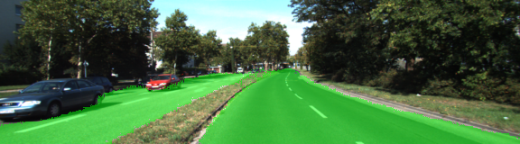

# Semantic Segmentation
### Overview
In this project, we trained a Fully Convolutional Network (FCN) using pre-pixelwise-labeled road scene images taken from in-car cameras. The trained FCN has a structure similar to a convolutional auto-encoder. The pre-trained VGG16 network is used as the base of the "decoder". A 1x1 convolutional layer is connecting the "decoder" and "encoder" to preserve geometric information. In addtion the feature maps extract from different levels of the VGG16 network are directly sent to the corresponding transpose convolutional layers in the "decoder" as extra input to take advantage of information extracted from multiple semantic levels. The model structure is a replicate from this paper: [Fully Convolutional Networks for Semantic Segmentation](http://ieeexplore.ieee.org/abstract/document/7478072/). 

### Experimental Environment

 - Ubuntu 16.04
 - python 3.5
 - tensorflow 1.3
 - nvidia driver 375
 - CUDA 8.0
 - NVIDIA TITAN X * 1

### Model Hyper-parameters

After several experiments, the following hyper-parameters are selected:

 - Epochs: 50
 - Batch size: 32
 - Learning rate: 0.0001
 - Dropouts: 0.25

`training_history.txt` shows the model training history of the experiment using the above hyper-parameters.

### Experimental Results

Five sample test samples are shown below. More samples can be found in folder `runs`





### Setup
##### Frameworks and Packages
Make sure you have the following is installed:
 - [Python 3](https://www.python.org/)
 - [TensorFlow](https://www.tensorflow.org/)
 - [NumPy](http://www.numpy.org/)
 - [SciPy](https://www.scipy.org/)
##### Dataset
Download the [Kitti Road dataset](http://www.cvlibs.net/datasets/kitti/eval_road.php) from [here](http://www.cvlibs.net/download.php?file=data_road.zip).  Extract the dataset in the `data` folder.  This will create the folder `data_road` with all the training a test images.

### Start
##### Run
Run the following command to run the project:
```
python main.py
```
